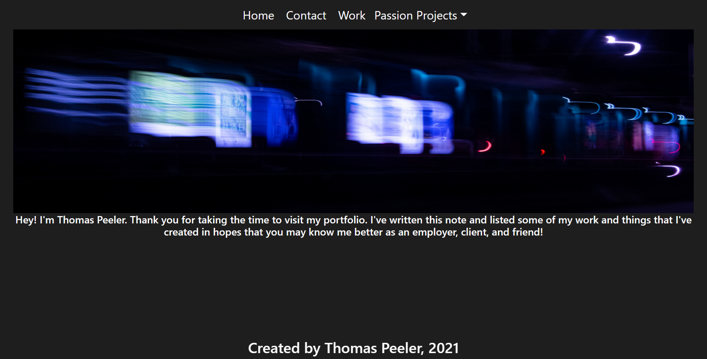

# react-profile
This react portfolio is supposed to demonstrate proficiency in react routing as well as component management and reuse of any repeated elements. It is also to serve ourselves as well as future peers, clients, and employers about who we are as individuals and what our skillset consists of.

## Getting Started
I started by creating a new repository and began making several starter files and directories that I would fill in later. Then I made sure to have all of my essential components and files such as my App.js and my index for actually starting the react app and rendering HTML content. After which I made sure that I had a JSON file full of project data and began constructing.

### Prerequisites
Make sure that the proper dependencies listed in the package.json are installed properly before attempting to run NPM start.

### Solving
While creating this portfolio I opted to code the majority of the layout in a dummy HTML file first to make sure that I had the proper layout that I wanted. After finishing the basic layout I began to transfer over larger portions of code to be turned into components. After writing out each component I made sure that I would have all of the pieces necessary which caused me to go back and refactor a solid amount of my code to work with react-router-dom instead of static react. I then created my project card and began testing. After all of my images and data showed up properly I began to do additional styling and testing of routes. Deploying was actually the most confusing part about this project because most hosting sites really really don't make it easy to use react routes.

## Technologies Used

* [JavaScript](https://www.javascript.com/)
* [React](https://reactjs.org/)
* [Bootstrap](https://getbootstrap.com/)
* [ReactRouter](https://reactrouter.com/)

## Screenshot 

;

## Authors
* **Thomas Peeler** 

## Github Repository
- [https://github.com/TMPeeler/react-profile]

## Deployed Link

- [https://tmpeeler.github.io/react-profile/]